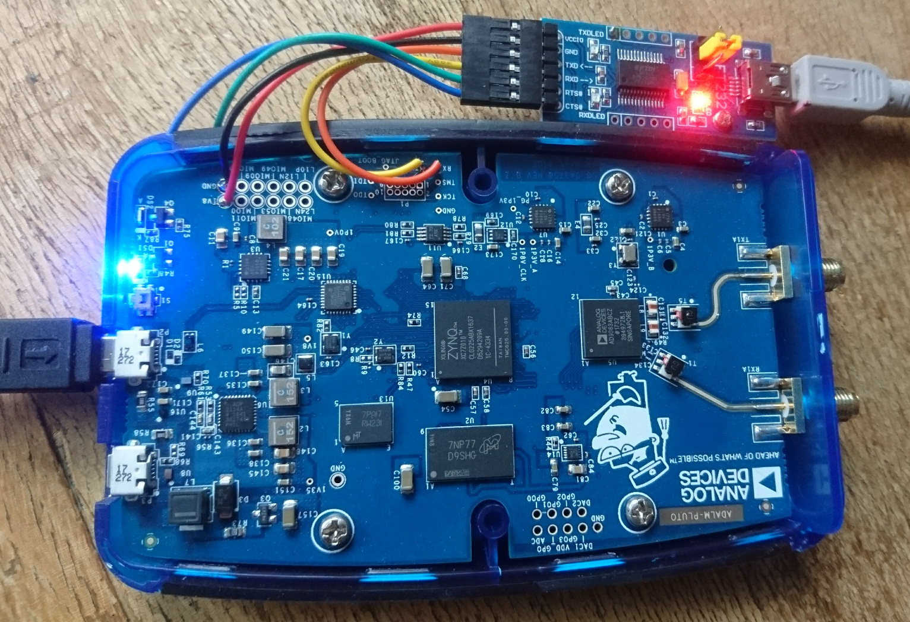

# PlutoSDR
BR2_EXTERNAL framework for Analog Device's PlutoSDR Zynq

This repository provides buildroot based support for ADALM-pluto board (based on
[Analog Device's plutosdr-fw](https://github.com/analogdevicesinc/plutosdr-fw)).

At the moment, this repository provides support for rootfs, linux and bootloader.

It uses the BR2_EXTERNAL mechanism to add this support to buildroot.

This support has been tested with the latest stable release of buildroot (2018.11.1) and git master branch.

How-to use it
=============

A ready-to-use image is available for the Raspberry Pi 4 at http://jmfriedt.org/sdcard.img including GNU Radio 3.8 and Qt5 support. Login=root, password=root.

### With *Buildroot* tag **v2024.08**

Download the tested buildroot tarball:
```bash
wget https://buildroot.org/downloads/buildroot-2024.08.tar.gz
```

If you wish to rename the directory, do so *before* running ``make zynq_pluto_defconfig`` (below) since some links in the tree structure created by the configuration will break if renaming the directory name afterward.

### Configure, build and install

Adding support for the PlutoSDR requires sourcing the **sourceme.ggm** file to add the **BR2_EXTERNAL** 
variable definition (alternatively, one might want to add <code>export
BR2_EXTERNAL=/somewhere/PlutoSDR</code> to the *.bashrc* initialization file).

In the buildroot directory  
```bash
make zynq_pluto_defconfig
```
will configure buildroot for minimal PlutoSDR support. More ambitious, after git cloning the 
latest release of buildroot,
```bash
make zynq_pluto_gnuradio_defconfig
```
will configure buildroot for PlutoSDR support in addition to GNURadio. The default configuration is
to not support Python, yielding a 13.4 MB image. Activating Python requires going to <code>Target Packages --> Interpreter
languages --> python</code> and then <code>Miscellaneous --> gnuradio --> python support</code>. We also 
activate gr-zeromq support to stream I/Q coefficients from the PlutoSDR to the PC. Do not attempt adding Python
support after compiling an image without Python support: the gnuradio packages would not be compiled properly.
Start from scratch from a clean output directory (<code>rm -rf output</code>). For the resulting image to be
smaller than 32 MB, we remove <code>wpa_supplicant</code> and associated 802.11 packages as well as <code>avahi</code>.

Overall, <code>make menuconfig</code> allows for configuring
additional settings of the buildroot environment, especially Target Packages, <code>make</code> builds
the images to be found at the end of the compilation in <code>output/images</code>.

The <code>output/images/pluto.frm</code> file is then copied to the mass storage mounted from the PlutoSDR (in
most cases <code>/dev/sdb1</code>)
and then written after ejecting the associated mass storage root (in this example <code>sudo eject /dev/sdb</code>) as 
explained at [Analog Device's PlutoSDR firmware information](https://wiki.analog.com/university/tools/pluto/users/firmware)

In case of failure, DFU programming provides a backup solution. **MAKE SURE TO POWER THE DIO PIN OF THE FTDI INTERFACE
WITH 1.8V and NOT the default 3.3 or 5V (that will definitely destroy the Zynq)**



Doing so does not necessarily require the FTDI USB to R232 converter, although this peripheral will provide a prompt to check what
is happening on the PlutoSDR. Switching to DFU mode is achieved by mounting the first mass storage partition (let's say /dev/sdb1),
modifying <code>config.txt</code> to set <code>dfu = 1</code>, and saving the change + rebooting the board with <code>sudo eject 
/dev/sdb</code>. Once the board is in DFU mode, the DFU image is flashed with <code>dfu-util  -D /tmp/pluto.dfu -a firmware.dfu</code>.

GNU Radio on the PlutoSDR
=========================

Listening to an FM station demodulated by the WBFM block running on the Zynq PS requires activating the
second CPU core, extending the AD9363 carrier frequency band to those of the AD9364, and compiling fftw with
speed optimization. With such considerations, the following [processing block](doc/top_block_for_pluto.py) runs on the PS of the Zynq to fetch samples from the AD9363 (local IIO connection), filter and demodulate the signal, and push to a 0MQ stream the sound signal at 24 or 48 kS/s. On the 0MQ receiver side, the following [processing block](doc/top_block_for_PC.py) is run on the PC to fetch data through a 0MQ socket and play sound on the PC speaker.

[Here is a movie demonstrating](doc/movie_FM_to_0MQstream.ogv) the acquisition of a FM station in the commercial
broadcast band, processing using the WBFM block running on the Zynq, streaming the data to the PC (at 24 kS/s rather
than the >200 kS/s needed to demodulate FM) and using the PC as a sound card. 

Activating hard-floating point processing is mandatory to achieve continuous FM demodulated sound stream: indeed, lacking the
[~40% processing gain](https://blog.paranoidpenguin.net/2017/09/hard-float-vs-soft-float-with-slackware-arm-on-the-rpi-3/) would 
result in discontinuous sound output due to insufficient computational power to run the WBFM block on the
minimum 200-kS/s input stream.

Custom bitstream on the PL
==========================

Customizing the PL bitstream meets some requirement for full control of the PlutoSDR features: in [this example](https://github.com/oscimp/oscimpDigital/tree/master/doc/tutorials/plutosdr/99-gnuradio-audio), an ALSA-compatible
audio output is added to make the PlutoSDR a fully autonomous FM-broadcast radio receiver. Adding such functionalities
requires generating a new bitstream including the additional block, generating a new DFU image to send to the PlutoSDR,
and telling GNU/Linux about the new reconfigurable hardware (devicetree entry). The [documentation](https://github.com/oscimp/oscimpDigital/blob/master/doc/tutorials/plutosdr/99-gnuradio-audio/1-gnuradio-audio.pdf) aims at describing all these steps.

gnss-sdr on embedded platforms
==============================

The BR2_EXTERNAL includes in the for_next branch packages that are not (yet) officially integrated in Buildroot,
including UHD (USRP Hardware Device from Ettus Research). Because this package is not officially integrated in Buildroot,
support for UHD in GNU Radio (which is officially supported in Buildroot) requires tuning the gnuradio package
configuration. In ``package/gnuradio/gnuradio.mk`` of the official Buildroot release, add ``-DENABLE_GR_UHD=ON``
to the ``GNURADIO_CONF_OPTS`` variable. If GNU Radio was already compiled before setting this option, then
``make gnuradio-reconfigure``. This option is mandatory for activating UHD support in gnss-sdr as well for live decoding
GNSS messages received by an USRP (e.g. B210).
