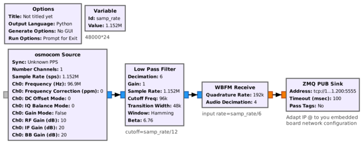
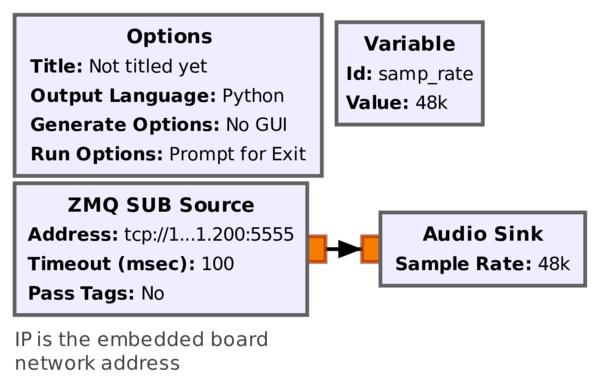
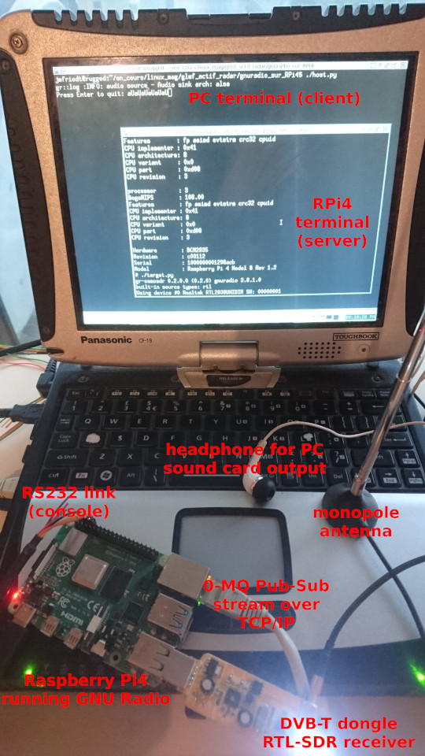

**Buildroot for cross-compiling GNU Radio to embedded
boards**  

The Raspberry Pi{3,4} (RPi) is a single board computer designed – for
the characteristics we are interested in for Software Defined Radio
applications – around a quad-core ARM processor clocked at 1.5 GHz with
1, 2 or 4 GB random access memory. The operating system is stored on a
microSD card and is hence easily updated from the host computer (never
*ever* compile on the target embedded board). Generating a
dedicated toolchain – as opposed to using a readily available binary
distribution – allows for optimizing instructions for the chipset
available on the targeted platform.

Our objective is to **execute GNU Radio on the RPi** in
order to run some pre-processing on the embedded board before sending
the processing result to the PC (e.g. receiving a broadcast FM station
on the RPi and send the audio output to the PC through a Zero-MQ link).

# Buildroot for RPi

Buildroot is a framework providing a consistent set of

  - cross-compilation toolchain for the host (usually Intel x86/AMD64
    processor)

  - libraries and userspace applications for the ARM target,

  - Linux kernel for the target,

  - bootloader for embedded target board initialization in order to load
    the Linux kernel in charge of supervizing userspace applications.

This consistency avoids many pitfalls when cross-compiling target
applications or kernel modules on the host. Obviously the
low-computational power target is *not* designed for
intensive computational load such as compiling GNU Radio, and
gcc should actually not even be available on the target,
neither is the SD card with its finite number of write cycles designed
for large compilation (at least make /tmp/ a RAM filesystem
if trying such a compiltion on the target).

Installing the result of Buildroot cross-compilation on the Raspberry
Pi4 is described at
<https://github.com/buildroot/buildroot/tree/master/board/raspberrypi>
but the documentation on this web page is not up to date (?\!):

1.  git clone https://git.busybox.net/buildroot

2.  cd buildroot

3.  make raspberrypi4\_64\_defconfig

fetches the Buildroot archive, and configures for the RaspberryPi4 in
64 bit mode (obviously for RPi3, select
raspberrypi3\_64\_defconfig). Because Python support for
GNU Radio will require the glibc library rather than the
default uClibc, we must tune the default configuration

4.  make menuconfig

5.  Toolchain -> C library (uClibc-ng) -> glibc

6.  Exit

Once the proper C-library has been selected

7.  make

builds all tools needed for cross-compilation. This operation will take
about 40 min on an 8-core 2.33 GHz Xeon CPU with fast internet connexion
and require 7.4 GB of hard disk space. While compiling, Buildroot
*only updates files stored* in the output
directory. Thus, removing this directory (and sub-directories) will
return to the original Buildroot configuration. All software related to
the host computer – Intel x86/AMD64 architecture most of the time – is
located in output/host, while all software related to the
target (here ARM architecture) is stored in output/target.
We shall not be interested in the content of the directory in which
source files are stored but might have to erase some of its content to
force re-compilation: such files are stored in the
output/build directory. Finally, the last compilation stage
will result in a complete image including bootloader, kernel, libraries
and userspace applications: this file is stored in
output/images.

After completing buildroot compilation, we find in the
output/images directory the file sdcard.img
which holds the binary datastream (about 150 MB) to be stored on the
microSD card holding the operating system to be run on the RPi. Here,
“stored” doe not mean copying since we must clone each byte from the
binary file to the storage medium. Such an operation is achieved under
GNU/Linux with the Disk Dump dd command.

/!\ The following line might definitely **corrupt a
hard disk** if the wrong storage medium is selected. Alway
**check** the name of the peripheral associated with the SD
card (`dmesg | tail`) before running the dd command.

The image resulting from Buildroot compilation is transfered to the
microSD card with  

sudo dd if=output/images/sdcard.img of=/dev/sdc

  
where we have on purpose selected the /dev/sdc peripheral
name in this example since it is ever hardly used. Usually, the microSD
card is accessed as /dev/sdb (second hard disk storage
medium compatible with the Linux SCSI driver) or
/dev/mmcblk0 (internal SD medium interface).

In case a Desktop Manager or a File Manager is used, make sure the SD
card is unmounted before executing dd, as these tools will
interfere with the cloning process.

Once the image has been flashed on the SD card, we can see two
partitions: the first one is a VFAT (format compatible with Microsoft
Windows) with the devicetree, the Linux kernel and the bootloader, and a
second one holding the GNU/Linux userspace filesystem
(rootfs).

# Adding custom packages (GNU Radio and PlutoSDR/UHD

So far we have compiled a standard Buildroot image without dedicated GNU
Radio support. Dedicated packages not selected in the default
configuration can be activated. This is achieved from the Buildroot
directory with make menuconfig and selecting Target
packages. Searching (“/” command as in vi) allows
for quickly finding the appropriate package, such as GNU Radio.

Up to now we have only worked with “official” Buildroot packages
properly maintained by the Buildroot community. Some packages are not
yet integrated in the official repository but can nevertheless be
appended as external packages thanks to the BR2\_EXTERNAL
mechanism. As an example of supporting the PlutoSDR thanks to
gr-iio, this support is available thanks to the
BR2\_EXTERNAL repository found at
<https://github.com/oscimp/PlutoSDR> and most significantly its
for\_next branch. Hence, after going to any directory out
of the Buildroot source tree:

1.  `git clone https://github.com/oscimp/PlutoSDR`

2.  `cd PlutoSDR`

3.  `git checkout for_next`

4.  `source sourceme.ggm`

Now that the BR2\_EXTERNAL has been cloned, the appropriate
branch selected, and the environment variables set (last command),
return in the Buildroot directory and make menuconfig.
Running make menuconfig will now show a new menu named
External options including gr-iio,
libuhd or gnss-sdr.

1.  `make menuconfig`

2.  `/eudev`

3.  Select the last item indicating
    BR2\_ROOTFS\_DEVICE\_CREATION\_DYNAMIC\_EUDEV and
    replace /dev management with Dynamic using
    devtmpfs + eudev

4.  `/python3`

5.  Select item (4) indicating BR2\_PACKAGE\_PYTHON3

6.  `/gnuradio`

7.  Select item (1) indicating BR2\_PACKAGE\_GNURADIO

8.  Select additional GNU Radio functionalities as needed (we will need
    gr-zeromq support and python support)

9.  `/osmosdr`

10. Select BR2\_PACKAGE\_GR\_OSMOSDR (with Python support
    and Osmocom RTLSDR support)

11. in External options select uhd and for the
    B210 b200 support and python API support,

12. in External options select gr-iio for
    PlutoSDR support.

The resulting file will be about 550 MB, requiring increasing the
configuration in .config with
BR2\_TARGET\_ROOTFS\_EXT2\_SIZE="420M".

Tuning the configuration prior to dd the SD card is
possible by adding files in output/target, e.g. a
etc/network/interfaces network configuration with a static
IP for example, or copying the USRP firmware from the host PC in the
usr/share/uhd/images subdirectory of
output/target for these files to be available later on the
target embedded board. After tuning the content of
output/target, execute make in the Buildroot
directory to re-build the output/images/sdcard.img file.

# GNU Radio on RPi

As a demonstration of the proper operation of GNU Radio on the embedded
board, we generate using GNU Radio Companion on the host computer a
command line interface (“No GUI”) processing flow since obviously no
graphical interface is running on the embedded target, and will execute
the resulting Python3 script on the Raspberry Pi. The audio stream
resulting from broadcast FM demodulation will be streamed to the host PC
for playing on the sound card.

On the host computer, run GNU Radio Companion (as part of GNU Radio 3.8)
and generate the following chart:

The generated Python script will be transfered and run on the RPi
platform. Make sure to adapt the 0-MQ TCP IP address to the RPi address:
the server is running on the embedded board and being a
Publish-Subscribe (like UDP broadcast) configuration, any client
connecting to the server running on the embedded board will be streamed
the dataflow. The IP address must match the subnet of the host PC for
easier routing configuration, and the port might be anything above 1024.
The only constraints on this flowgraph is to achieve a final sampling
rate matching the PC sound card sampling rate (here 48 kHz) following an
integer decimation, here tuned with an initial sampling rate of
\(48\time 24\) kS/s. The first low-pass filter selects a unique FM
broadcast station while still keeping enough bandwidth (\(\geq\)200 kHz)
for wideband FM demodulation, and the FM demodulator add the second
decimation stage.

# Communication RPi to PC

After processing the raw RF (I/Q) signal collected from the FM broadcast
band by the RPi, and preprocessing FM demodulation on the embedded
target board, the audio stream is sent PC over 0-MQ.

  Left: client
flowchart, fetching a 0-MQ subscribe datastream and feeding the sound
card of the host PC. Right: experimental testbed, with the RPi4
connected though virtual serial port and Ethernet to the laptop PC. The
RPi4 collects an I/Q stream from the DVB-T dongle tuned to an
FM-broadcast station, streams the demodulated audio flow to the PC,
allowing to listen to the program on the headset connected to the sound
card output. Not heard on this figure is the excellent sound quality
heard on the headset, demonstrating perfect functional capability of
this setup.

# Software development

We are interested in tuning the gnss-sdr functionalities.
The source code of the software has been downloaded in the
output/build directory if selected and installed. The build
directory for the target system is found in
output/build/gnss-sdr-0.0.13/buildroot-build/ while a
separate output/build/gnss-sdr-0.0.13/build allows for
simultaneously testing source code modifications on the host PC. The
output of compiling (make), either in
buildroot-build (ARM target) or build (x86
target), is found in  src/main/gnss-sdr.
